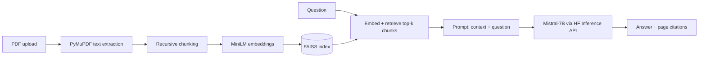

# Marginalia — PDF Research Assistant

A retrieval-augmented generation (RAG) app that answers questions **only** from PDFs you upload, and cites the exact source file and page for every answer. No hallucinated facts, no guessing outside the document.

> Built to demonstrate a full, working RAG pipeline end-to-end: PDF ingestion → chunking → embeddings → vector search → grounded LLM generation → cited answers, wrapped in a small FastAPI backend and a vanilla JS frontend.

## Why this exists

Most "chat with your PDF" demos skip the parts that make RAG actually useful in practice: knowing *where* an answer came from, handling documents that don't parse cleanly, and not silently losing data when you add a second file. This project prioritizes those details over adding more features.

## Features

- **Upload any number of PDFs** — drag-and-drop or file picker, indexed incrementally (new uploads are added to the existing index, not overwritten)
- **Page-level citations** on every answer, so you can verify the source instead of trusting the model blindly
- **Grounded answers only** — the prompt instructs the model to say it doesn't know rather than invent an answer when the context doesn't contain one
- **Local embeddings** (`sentence-transformers/all-MiniLM-L6-v2`) via FAISS, so only the final generation step calls an external API
- **Clean failure states** — no documents uploaded, unreadable PDF, missing API key, and backend-unreachable all surface as readable messages, not stack traces
- **One-click reset** to clear the index and start a fresh demo

## Architecture



**Backend:** FastAPI · LangChain · FAISS · PyMuPDF · Hugging Face Inference API (Mistral-7B-Instruct)
**Frontend:** Vanilla HTML/CSS/JS (no build step) — a "reading room" themed UI with live backend status, drag-and-drop upload, and citation chips

## Project structure

```
rag_system/
├── backend/
│   ├── app/
│   │   ├── api/routes.py         # /upload, /ask, /documents, /reset, /health
│   │   ├── core/
│   │   │   ├── config.py         # env-driven settings (pydantic-settings)
│   │   │   └── prompts.py        # the grounding prompt template
│   │   ├── models/schemas.py     # request/response contracts
│   │   ├── services/
│   │   │   ├── pdf_loader.py     # page-wise text extraction
│   │   │   ├── text_splitter.py  # chunking
│   │   │   ├── embeddings.py     # MiniLM embedding model
│   │   │   ├── vector_store.py   # FAISS create/merge/reset
│   │   │   ├── retriever.py      # top-k retrieval
│   │   │   └── llm.py            # HF Inference API call
│   │   └── main.py               # FastAPI app + CORS
│   ├── requirements.txt
│   └── .env.example
└── frontend/
    ├── index.html
    ├── style.css
    └── script.js
```

## Getting started

### 1. Backend

```bash
cd backend
python -m venv .venv
source .venv/bin/activate   # Windows: .venv\Scripts\activate
pip install -r requirements.txt

cp .env.example .env
# then edit .env and add your Groq API key
# (create one at https://console.groq.com/keys — the free tier is enough)

uvicorn app.main:app --reload
```

The API is now at `http://127.0.0.1:8000`, and the frontend is served from the same
server at `http://127.0.0.1:8000/` (interactive API docs at `/docs`).

### 2. Frontend

The FastAPI app in step 1 already serves `frontend/` as static files, so
visiting `http://127.0.0.1:8000/` is enough for local dev — no separate step needed.

If you'd rather run frontend and backend as two separate local servers (e.g. for
frontend-only editing with live reload), you can still do:

```bash
cd frontend
python -m http.server 5500
```

Then visit `http://127.0.0.1:5500`, and set `window.API_BASE_URL = "http://127.0.0.1:8000/api"`
in `index.html` before the `script.js` tag so requests reach the backend. Add
`http://127.0.0.1:5500` to `ALLOWED_ORIGINS` in `backend/.env` too.

## Deploying to Render

This repo includes a `render.yaml` Blueprint that deploys the FastAPI backend
*and* the static frontend together as a single Render web service (no separate
static site needed, since `app/main.py` mounts `frontend/` itself).

1. Push this repo to GitHub.
2. In the Render dashboard: **New > Blueprint**, point it at your repo. Render
   will read `render.yaml` and set up the service automatically.
3. Before the first deploy finishes, set the `GROQ_API_KEY` environment
   variable on the service (it's marked `sync: false` in `render.yaml` so it
   isn't stored in the repo — add it via the Render dashboard).
4. Once deployed, visit the service's `onrender.com` URL — that's both the UI
   and the API (`/api/health`, `/api/ask`, etc.).

**Two things worth knowing before you deploy:**

- **Uploads and the FAISS index don't persist across deploys/restarts** on
  Render's default ephemeral disk. That's fine for a demo; for durability,
  attach a [Render Disk](https://render.com/docs/disks) mounted at, say,
  `backend/app/data`, or swap in a managed vector DB as the README's "Design
  notes" section suggests.
- **Memory**: `sentence-transformers` pulls in `torch`, which is the heaviest
  dependency here. `requirements.txt` forces the CPU-only torch wheel to keep
  the install small, but the free Render plan (512MB RAM) can still be tight.
  If the service fails health checks or crashes under load, upgrade to the
  Starter plan.

## API reference

All endpoints are served under the `/api` prefix (e.g. `/api/health`).

| Method | Endpoint          | Description                                  |
|--------|-------------------|-----------------------------------------------|
| GET    | `/api/health`     | Liveness check                                |
| GET    | `/api/documents`  | List currently indexed PDFs                   |
| POST   | `/api/upload`     | Upload + index a PDF (`multipart/form-data`)  |
| POST   | `/api/ask`        | `{"question": "..."}` → answer + citations    |
| DELETE | `/api/reset`      | Clear the index and uploaded files            |

## Design notes / trade-offs

- **FAISS over a managed vector DB** — keeps the project runnable with zero external infra for a demo; swapping in Pinecone/Weaviate would mean changing `vector_store.py` and `retriever.py` only.
- **`allow_dangerous_deserialization=True`** is required by LangChain to load a locally-saved FAISS index (it uses pickle for metadata). This is safe here because the index is only ever written by this app itself — never load an index you didn't generate.
- **Local embeddings, remote generation** — embedding every chunk through an API would be slow and costly; only the final answer generation needs a hosted LLM.
- **No auth / multi-tenancy** — this is a single-user local demo. A production version would scope the index per user/session rather than sharing one global FAISS store.
- **Hugging Face's free Inference API is a moving target** — HF periodically retires models from specific providers, which surfaces as `doesn't support task 'conversational'`. Rather than depend on one model name staying live, `generate_answer` tries `LLM_MODEL_NAME` first and then walks through `LLM_FALLBACK_MODELS` in order, using whichever the router actually serves. If every candidate fails, `/ask` returns a 503 listing what was tried and a link to [the current model list](https://huggingface.co/docs/inference-providers/en/tasks/chat-completion) — update `.env` with a live one from there.

## Possible extensions

- Streaming responses (token-by-token) instead of waiting for the full answer
- Swap FAISS for a hosted vector DB to support concurrent users
- Add a re-ranking step after retrieval for higher precision on long documents
- Support non-PDF formats (docx, plain text, web pages)

## License

MIT — see [LICENSE](LICENSE).
